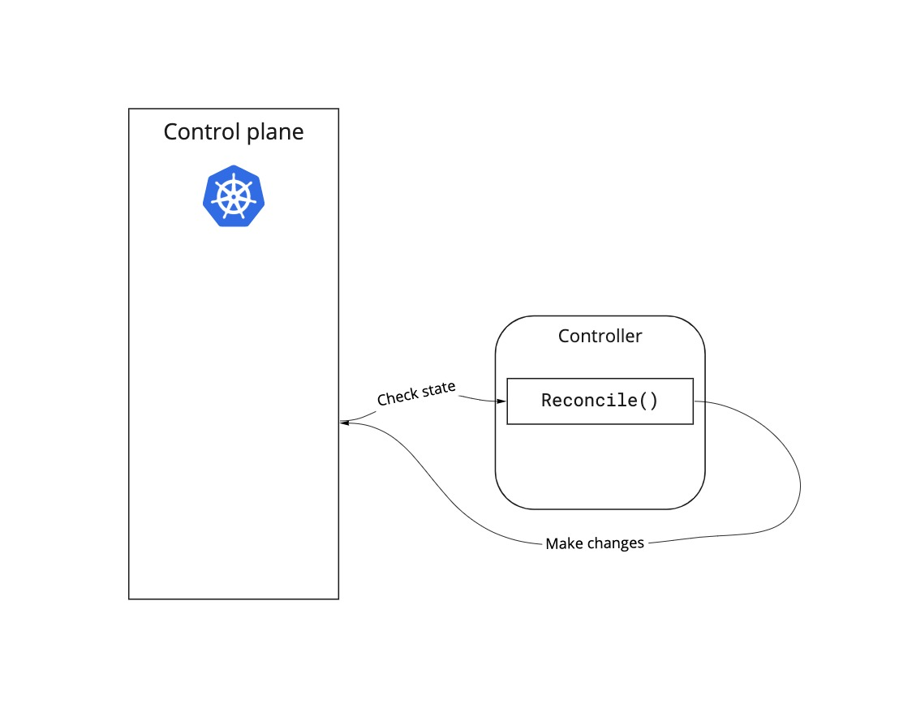

# Extending the Kubernetes API using Operators

This article is aimed at developers already familiar with Kubernetes, and who are interested in extending the capabilities of a Kubernetes cluster. 

## Overview

Kubernetes defines a set of primitives that are the building blocks for running containerized applications. These include Pods (for running containers), Persistent Volumes (for defining storage), and Services (for exposing applications on a network). Each of these primitives is a different **Kind** (analogous to a type in a programming language). 

The full set of primitives enable you to build, run, and operate qutie sophisticated applications, but they are very generic abstractions. Running real world applications and services (like message queues and databases) can get complicated quite quickly. 

Each object on your Kubernetes cluster is defined with YAML configuration file. And they all start like these ones: 
  
    apiVersion: v1
    kind: Pod 
    ---
    apiVersion: v1
    kind: PersistentVolume
    ---
    apiVersion: v1
    kind: Service

The API for the Kubernetes primitives is the only one which does not have an explicit group name (explained in next section), which is why configuration iles for those start `apiVersion: v1`. You can extend the Kubernetes API on a cluster by defining a new `Kind` and the operator code to provide the behaviour needed to run objects of the new Kind on the cluster. 

 ## New Kinds 

You add a new Kind to a cluster by creating and installing a Custom Resource Definition (CRD). The new Kind will belong to a versioned API group you also define. Often, several related Kinds will all be defined as part of the same API group. For example, [cert-manager](https://cert-manager.io) defines an API for managing X.509 certificates in a cluster. It defines several Kinds including `Certificate` and `Issuer`. 

These both belong to the `cert-manager.io` API Group, currently at version `v1`. The configuration file for Kubernetes objects always starts with the specification for the Group Version Kind (GVK). For example, a cert-manager `Issuer` configuration always starts like this: 

    apiVersion: cert-manager.io/v1
    kind: Issuer 

### Controllers

The CRD describes the configuration needed to define the desired state of an object. That state is usually expressed as Pods and other Kubernetes primitives that will run on the cluster (although in theory a Kind could actually be a cluster representation of an external resource). As well as a CRD you need a Controller which can read the definition of the object, and then make the changes needed to bring about the desired state. 

The `Reconcile` function is the heart of the controller. The Kubernetes control plane calls this function for each object of the `Kind` registered for that controller. The `Reconcile` function compares the state of the cluster with the desired object state, and makes any changes needed to bring that state about. The function return value is the interval to wait before calling it for that object again. 

The control plane will continue to call the `Reconcile` function for the lifetime of the object. The *reconcilation loop* is at the heart of the Kubernetes state-driven model; the Kubernetes user specifies a desired state, the Control Plane compares this to the current state and makes adjustments accordingly. In the case of custom Kinds, the Control Plane delegates this work to the controller for that Kind. 



This reconciliation loop enables the controller to request a change and then wait to see if the desired state is now reached. It also gives the controller the opportunity to repair the state if it changes due to other events. 

## Why Extend the Kubernetes API? 

Writing your own Operators and CRDs to extend the Kubernetes API is not a trivial exercise, so what new capability does it unlock? There are two answers to that question, and the first answer is "nothing" - you are still running software on your cluster using the standard Kubernetes objects - Pods, Services, Deployments, etc. The second answer is "quite a lot"; the abstractions offered by the standard Kubernetes primitives are low-level and running real applications can be complex. 

For example, running a stateful application like a database in production is more complex than just instantiating a Pod running a database container. You need persistent storage, defined networking, secrets, and failover. Defining an API for this enables you to embody a set of rules into your CRD and Operator for how a database should be set up and managed. Anyone can instantiate the new database Kind you have defined, setting the parameters allowed by the CRD to produce consistent setups. 

You could argue that a package manager like Helm does something similar, in that it simplifies the setup of a complex package and provides the end-user a set of values they can alter to meet their needs. For example, Helm packags often include parameters for things like CPU and memory requirements. A Helm package simplifies setup, but it does not define new Kinds or provide a reconciliation loop to operate them. 

This article describes a simple CRD for running a Postgres database (Kind). To keep it easy to understand it simply runs the database as a single Pod with no persistent storage; is is not suitable for serious use. However, it abstracts away the details that you would normally have to set up to run your Pod and has two parameters - the default user, and the default user's password, which you would otherwise set up through separate ConfigMaps or Secrets. 

The CRD is part of API group `database.db.exmple.com/v1`, and defines Kind `Postgresql`. Imagine extending the API group `database.db.exmple.com/v1` to simplify operating a production database. For example, a `Backup` kind would let you specify full or incremental backup, a schedule for running the backup, and a target URL to copy it to. Now your  database backup schedules can be defined declaratively as Kubernetes objects and the control plane/operator reconciliation loop will take care of running them. Extending the Kubernetes API enables you to add functionality in a way that is very simple for cluster users or administrators to consume. This is the kind of scenario that Operators and CRDs enable that would be hard to achieve using Kubernetes primitives or a package manager. 

# The Example Code

The Postgresql example is at [https://github.com/pkpivot/pg-simple-operator](https://github.com/pkpivot/pg-simple-operator) on Github. You can clone or fork the repository and run it on your own Kubernetes cluster to see it working. This repository contains the code to extend a cluster with a `database v1` API Group, consisting of a single new Kind, `Postgresql`. The example is intended as a simple start to the world of Kubernetes Operators, showing you how to create the Kubernetes objects that represent a custom Kind, as well as how to clean up if those custom objects are deleted. This example ***does not*** show you how to run a production ready Postgresql server on a Kubernetes cluster. 

The remainder of this article will explain how to run the example, and how the code works. 

## Prerequisites

Before you start you will need access to a Kubernetes cluster. Everything in this article was developed using [Minikube](https://minikube.sigs.k8s.io/docs/start/). You also need access to an image repository. If your cluster can access the internet you can use a free account on [Docker Hub](https://hub.docker.com). 

You will also need a [Go](https://go.dev) development environment. Kubernetes is written in Go, and although you can write controller code in other languages, Go is the best supported for this. All the Kubernetes APIs are available through Go modules. You can install Go on MacOS with homebrew:

`brew install go` 

Finally, you will need to install [`kubebuilder`](https://book.kubebuilder.io/quick-start.html). At the moment there is no support for `kubebuilder` on Windows, but it will run on the Windows Subsystem for Linux (WSL). You need to install Go on the WSL before you can install `kubebuilder`. 

## Running the API Extension

In this article you can follow a worked example of extending the Kubernetes API with a `database v1` Group, consisting of a single new Kind, `Postgresql`. This example shows you how to get started with extending the Kubernetes API with your own CRDs. It ***does not*** show you how to run a production ready Postgresql server on a Kubernetes cluster. This would make the example too complex for a short article like this. 

A `Postgresql` configuration will look like this: 

    apiVersion: database.technotuesday.io/v1
    kind: Postgresql
     metadata:
        name: postgresql-sample
    spec:
        password: "Password123!"
        defaultUser: "postgres"


If you apply this configuration file to a cluster running the Controller defined here, you will get a Pod running a database server, configured with a password and defaultUser. 

 As stated earlier, this won't create a database server you could actually rely on. For example, you would want to be able to specify the compute and persistent storage for the database. You would probably also use a StatefulSet rather than a Pod so that you could define and configure a server cluster with failover capability. 

To build and run the example you will follow these steps: 

1. Generate the project for a new API Group Version. 
1. Create a template Custom Resource Definition
1. Define the CRD specification and status as Go types.  
1. Define the controller `Reconcile()` function. 
1. Generate a CRD manifest from the Go definitions and install into your cluster.  
1. Run/Debug the controller outside the cluster. 
1. Install the controller into the cluster. 

## Generate Project and CRD template

In this first step you name and versionfcert your API group. Kubernetes requires every API group to belong to a domain. The domain ensures that all APIs have a unique fully qualified name. For example, the `cred-manager` APIs (mentioned in the [New Kinds]() section earlier) are part of the `cert-manager.io` domain. When you generate the project with kubebuilder, one of the parameters is the domain. When providing an API you intend to make publicly available you should use a domain name that you control in order to avoid potential name clashes with other third-party APIs. However, `kubebuilder` only checks the validity of a domain name, not its ownership, so for this article, `example.com` will work as well as anything else. 

The other important parameter is the repo name. This is used to name the Go module for the project, which avoids name-clashes with other Go projects. In the command below I've used the repo containing the original code for this example; you can create your own github repo and use that name instead. 

To create the project: 

* `kubebuilder init --domain technotuesday.io --repo github.com/pkpivot/pg-simple-operator`

To generate the CRD and controller templates run the command below and respond `y` to the `Create resource` and `Create Controller` prompts: 

* `kubebuilder create api --group database --version v1 --kind Postgresql`

At this point you have a Go project with a module initialized with the dependencies needed to work with the Kubernetes API. The main points of interest: 

* `main.go` contains the code that will connect your controller (`PostgresqlReconciler`) to the Kubernetes control plane. 

* `Makefile` includes targets for building and running the controller, testing it, and for enerating the Kubernetes manifeest for your CRD. 

* Under `api/v1` the `postgresql_types.go` file contains the template where you will define your CRD. 

* Under `controllers` the `postgresql_controller.go` file defines the `PostgresqlReconciler` type together with a template `Reconcile` method. 

* Under `config/crd` are `kustomize` templates to generate your CRD manifest (run `make manifests`)

* Under `config/samples` a template manifest for running an object of your new kind on the cluster 

In the next section, you add the code defining your new CRD. 

## Create the CRD

CRDs are specified to a Kubernetes cluster by YAML manifest. However, `kubebuilder` enables us to use Go type definitions as a specification from which it generates the manifest. This is easier than creating the manifest by hand, and also ensures that the Go and Kubernetes definitions of the CRD are aligned.

To generate the CRDs and Go templates: 

* Run the following command and respond `y` to the `Create resource` and `Create Controller` prompts: 

```kubebuilder create api --group database --version v1 --kind Postgresql```

This generates several new directories and files in your project, including the`api/v1` and `controllers` directories. The Go type definition tenplates for the `Postgresql` kind are in the `api/v1` directory, and the controller template is in the `controllers` directory. Now you need to fill in the details. 

1. Open `api/v1/postgresql_types.go`. You are going to define two fields for your Postgresql object, `DefaultUser` and `Password`. 

1. Find the type definition for `PostgresqlSpec` and change it to: 

```
type PostgresqlSpec struct {
	DefaultUser string `json:"defaultUser"`
	Password string `json:"password"`
}
```

3.  We also want to define a status for our object so add the following new type definition and constants: 

```
type PgPhase string

const (
	PgUp      PgPhase = "up"
	PgPending PgPhase = "pending"
	PgFailed  PgPhase = "Failed"
)
```

4. Then change the PostgresqlStatus type definition to: 

```

type PostgresqlStatus struct {
	Phase PgPhase `json:"pgPhase,omitempty"`
	Active corev1.ObjectReference `json:"active,omitempty"`
}
```

Once you've finished, your `postgresql_types.go` file should look like the one in the original example repository [https://github.com/pkpivot/pg-simple-operator](https://github.com/pkpivot/pg-simple-operator). 

You have now defined the Go object that represents the custom Kind Postgresql. To create the manifests for the CRD, and install them into the cluster, run: 

    make manifests
    make install

If you later change the definition of the Go object rerun those commands to keep the CRD in step with the Go code. At this point you have defined custom Kind Postgresql, and made it available on your cluster. You can even create a Postgresql object on the cluster, but no other Kubernetes objects will be created to do the actual work of the object. For that you need the controller code described in the next section. 

## Add code to the Reconcile Function

Kubebuilder has created the outline of a controller in `controllers/postgresql_controller.go`. This file defines a `controllers` package and the `PostgresqlReconciler` type: 

    type PostgresqlReconciler struct {
        client.Client
        Scheme *runtime.Scheme
    }

This struct includes an anonymous `Client` object (from the Kubernetes package `sigs.k8s.io/controller-runtime/pkg/client`). All `Client` public functions are available as part of `PostgresqlReconciler` - Go uses aggregation rather than inheritance to reuse functionality from other types. The `Reconcile` function looks like this at the moment: 

    func (r *PostgresqlReconciler) Reconcile(ctx context.Context, req ctrl.Request) (ctrl.Result, error) {
        _ = log.FromContext(ctx)

        // TODO(user): your logic here

        return ctrl.Result{}, nil
    }

To create a fully functioning controller, copy `controllers/postgresql_controller.go` from the sample repository [https://github.com/pkpivot/pg-simple-operator](https://github.com/pkpivot/pg-simple-operator) over the template. There now follows a description of the main parts of the code. The `Reconcile()` function contains the basic logic flow, although some of the code has been broken out into helper functions to make it easier to follow. 

This is what happens in the `Reconcile()` function. Remember, this function will be called for each Postgresql object on the cluster in turn. The very last statement in the cluster tells the Control Plane to wait 5 seconds before invoking `Reconcile()` for the same object again: 

`return ctrl.Result{RequeueAfter: time.Second * 5}, nil`

The rest of the logic is as follows: 

1. After fetching a logger from the context, try to retrieve a Pod of the same name as the Postgresql object and in the same namespace. If one doesn't exist, create it, and return to the control plane, but requeue this object for the next reconciliation pass in 5 seconds.

1. The second time through `Reconcile()` the expected Pod should be found. Now we check the Pod's lifecycle phase, so that we can update the status of the Postgresql object. Once the Pod is running, the Postgresql object status is set to `up`. 

1. The next thing is to register a finalizer for the Postgresql object. This is done by a helper method which will only register a finalizer if it hasn't already been done. Finalizers are explained below. 

1. Next we check to see if the Postgresql object is actually in a `deleting` state - ie, someone has run the `kubectl delete` command against it. If it is being deleted, we use another helper method to delete all the resources associated with it. In this case, just the Pod. 

You can examine the code in `Reconcile()` and the other helper methods in detail to see exactly how they work. Most of the code is calling functions on the Kubernetes API (provided by the aggregated `client` object as explained above). 

### RBAC Markers

In `postgresql_controller.go`, between the type definition of the `PostgresqlReconciler` and the `Reconcile()` function, are four lines of comments in this form: 

```//+kubebuilder:rbac...```

When you deploy the controller to a cluster these validation markers create Role-based Access Control (RBAC) permissions applied to your controller. The first three lines are those generated by kubebuilder. There is one extra line added to enable the controller to list, create, and delete Pods. When you run the controller outside the cluster (in the section *Running the Operator*) the controller has your user permissions, but when you run deploy it onto the cluster it only has the permissions defined by `ClusterRole pg-simple-operator-manager-role`. 
 
### Finalizers

What is the finalizer for? When you register a finalizer against an object, the Kubernetes Control Plane doesn't mark an object as deleted until the finalizer has been removed. In the case of this controller, when you give the command to delete a Postgresql object, it is put into the deleting state. When the deleting state is detected in the `Reconcile()` function, the `deleteExternalResources()` function checks to see if the finalizer is present, requests pod deletion, and then removes the finalizer. 

## Running the Operator 

The Go code for the operator is a runnable application with a `Main()` function (in `main.go`). To run the application: 

1. Open a terminal. 

1. Change directory to the root of your project folder. 

1. To start the controller:

    `make run` 

    Alternatively: 

    `go run main.go`

The application will run using the credentials and connection details in your current kubeconfig context. The code that retrieves the context and connects your controller to the Kubernetes control plane is in the application's `Main()` function. Leave the application running in the terminal so that we can try out the functionality: 

1. Open another terminal. 

1. Install the CRDs into your cluster. 

   `make manifests`</br>
   `make install`

1. Now you can query to see if there are any Postgresql instances running in the current namespace: 

    `kubectl get postgresql` 

    You should see the message `No resources found in default namespace.` This shows you that the CRD is installed because the cluster now recognises `postgresql` as a type of resource - otherwise you'd see an error message instead. 

1. Now you can create a manifest for a Postgresql instance. When you added the CRD earlier, `kubebuilder` created a template. Open `config/samples/database_v1_postgresql.yaml` and edit it to look like this: 

        apiVersion: database.db.example.com/v1
        kind: Postgresql
        metadata:
            name: mydb
        spec:
            defaultuser: "pgowner"
            password: "password123"

1. Then run: 

    `kubectl apply -f config/samples/database_v1_postgresql.yaml`

   Log messages from the `Reconcile()` function in the controller start scrolling up the terminal running the controller application. The first message or two will show that the pod created by the controller is in the `Pending` phase.

1. To see the Pod that has been created to run the database server we asked for:  

    `kubectl get pod`

    You can also see information about the Postgresql resource created: 

    `kubectl describe postgresql mydb` 

    At the bottom of the information from this command you should see: 

    `Pg Phase: up` 

    (It will only be `up` once the Pod is `Running`). 
    
1. You can also demonstrate the declarative nature of Kubernetes. By apply the manifest in step 5, we told Kubernetes that the state we want maintained is a running Pod that hosts the database we have declared. Give the commands: 

    `kubectl delete pod mydb` 
    `kubectl get pod` 

    The `get pod` command will show that a pod has been created. The reconciliation loop for Postgresql mydb is being run every 5 seconds, and the first time it runs after the pod has been deleted it will create a new pod because it can't find one. 

1. Delete the Postgresql resource: 

    `kubectl delete postgresql mydb` 

    The deletion code that is part of the reconciliation loop for Postgresql resources will remove the associated Pod and then the Kubernetes control plane removes the Postgresql resource once the finalizer is released. 

You've now seen the controller run, and seen how it creates and deletes resources associated with the Postgresql kind we've added to the cluster. Running the controller locally (that is, not on the cluster) like this makes it much easier to develop and debug your code. To put your operator into production though, you need to deploy it on the cluster, which you'll do in the next section. 

## Deploying the Controller

You deploy the controller in the same way that you deploy anything to Kubernetes; build an image and then run it in a Pod on the cluster. The `makefile` created by `kubebuilder` has targets to simplify this for you. However, the `docker-build` target assumes you have `docker` installed; if you are using an alternative tool for building and managing container images you can either change the `docker-build` and `docker-push` targets in the makefile, or run the commands yourself. 

To use the make targets to build the controller image and push it to your image repository: 

```
export IMG=your-image-repo/pg-simple-operator:latest
make docker-build docker-push 
```

To deploy the controller to your cluster: 

```
make deploy
```

When you deploy the controller, the resources are created in a new namespace, `pg-simple-operator-system`. To see the resources created: 

```
kubectl get all -n pg-simple-operator-system
```

## Conclusion 

The extensible Kubernetes API enables administrators to add new facilities to a cluster, simplifying the deployment and management of complex applications. I hope this article has given you a starting point to explore building your own operators. 
  